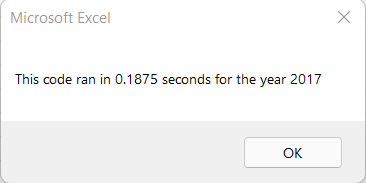
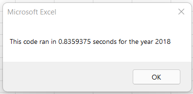
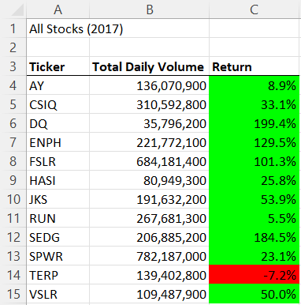
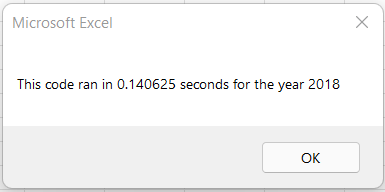
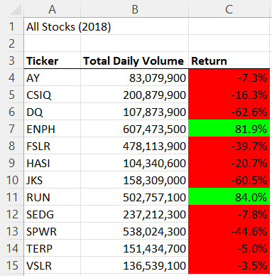

# Module 2 Challenge

## Overview of Project

### Purpose

The purpose of this project is to help Steve analyze an entire dataset at the touch of a button.
Steve needs to do more research for his parents and requires our help gathering data from 2017
and 2018. This will help him decide what stocks are best to invest in based on info gathered from
past years.

We need to refactor our code to loop through the data and collect info all at once. Refactoring 
is used heavily within the software engineering field due to legacy code that is already in place
in every industry that uses software to maintain their business.
Refactoring will help us reach a conclusion faster and will help make the code work smoother.

### Results: Using images and examples of your code, compare the stock performance between 2017 and 2018, as well as the execution times of the original script and the refactored script.

Below you see the refactored code time to produce results is much faster then the original code both for 2017 and 2018:

2017 Refactored - 

2017 Original - 

2017 Results - 

Code example - 
>

2018 Refactored - 

2018 Original - 

2018 Results - 

Code example - Below we are interchanging i with rowStart, either can be used but must be consistent throughout your macros/subroutines

>  For rowStart = 2 To RowCount

### Summary: In a summary statement, address the following questions.

Advantages of refactoring code is that you can streamline the code, make it more efficient, run faster, look cleaner, and maybe add additional notes to help assist the next coder.

Disadvantages include taking lots of time to refactor if it works which will cut into budget of any business due to low resources.

Pros apply to original VBA script completely because the code runs faster, looks cleaner, has more spacing, and more notations have been added.

Cons do not apply because there is no budget. Yes it did take long to refactor but that is because of how new I am to coding.
